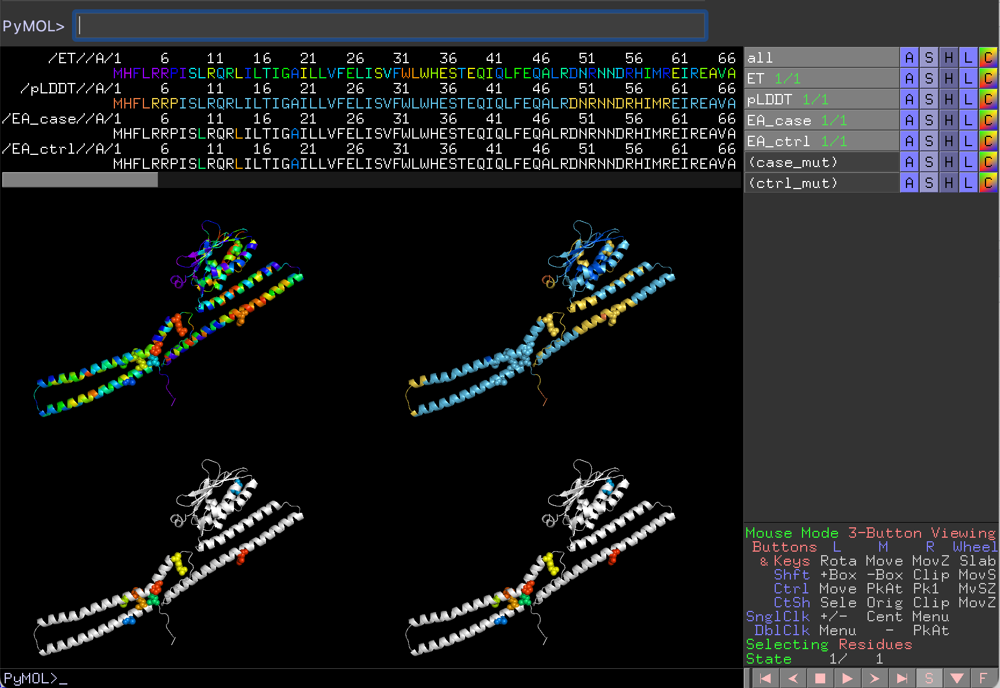

```{r setup, include=FALSE}
knitr::opts_chunk$set(echo = TRUE)
```

This tutorial explains how to use functions in the EvoTrace package to 
plot variants on to lollipop plots and AlphaFold protein structures. 
Currently both functions only support human (ENSP id) and E. coli proteins (b number). 

## 1. Installation
I recommend running R code with [Rstudio](https://posit.co/download/rstudio-desktop/). If you 
don't want to install Rstudio on you local computer, you can use Rstudio server on Taco with 
your BCM logins. 
[http://mhgcp-r00.grid.bcm.edu:8787/](http://mhgcp-r00.grid.bcm.edu:8787/),  [http://mhgcp-r01.grid.bcm.edu:8787/](http://mhgcp-r01.grid.bcm.edu:8787/)


EvoTrace library can be directly installed through Github. To do so, you need to setup Github token for R. But setting this up allows easy installation for future updates. Check this [link]("https://gist.github.com/Z3tt/3dab3535007acf108391649766409421) for details.
```{r, eval=FALSE}
if (!"remote" %in% installed.packages()) {
  install.packages("remote")
}
remotes::install_github("LichtargeLab/EvoTrace", build_vignettes = FALSE)
```


The package can also be installed through downloaded zip file of the [repo]("https://github.com/LichtargeLab/EvoTrace"). 

```{r, eval=FALSE}
if (!"devtools" %in% installed.packages()) {
  install.packages("devtools")
}
devtools::install_local("EvoTrace-master.zip")
```


## 2. Prepare input file
The input files for both lollipop plots and structure mappings are R dataframe. 
For lollipop plots "SUB", "EA" and "AC" columns are required. For mapping to 
protein structures, "SUB" and "EA" columns are required. Single lettere amino
acids should be used in the SUB column, eg, G18T. "AC" stands for allele count.
Mutations from basS are used as example. Your own data can be loaded with readr::read_csv()
or readr::read_tsv() functions.
```{r, message=FALSE}
# attach library
library(EvoTrace)
```

```{r}
# protein id use full ENSP for human protein and b number for E coli protein
prot_id <- "b4112"

# load mutations
basS_muts <- read_tsv(file.path(system.file("extdata", package = "EvoTrace"),
                                "basS_muts.tsv"),
                      show_col_types = FALSE) 
# generate random allele counts 
set.seed(566)
mut_case <- basS_muts %>%
  mutate(AC = runif(11, 0, 1000)) %>%
  mutate(AC = round(AC))

mut_controls <- basS_muts %>%
  mutate(AC = runif(11, 0, 300)) %>%
  mutate(AC = round(AC)) 

mut_case
mut_controls
```


## 3. Lollipop plot
Lollipop plot for case vs control can be plotted with LollipopPlot2()
Lollipop plot for only case can be plotted with Lollipop()
Protein domains are extracted from Uniprot.
The detailed parameters for each function can be accessed with:
```{r}
?LollipopPlot2
?LollipopPlot
```

Case only lollipop plot. Here the circles on the lollipop plot are scaled 
with EA bins.
```{r, fig.height = 4}
LollipopPlot2(variants_case = mut_case, variants_ctrl = mut_controls, 
              prot_id = prot_id, plot_domain = TRUE, AC_scale = "log", 
              show_EA_bin = TRUE, fix_scale = TRUE, EA_color = "prismatic")
```

Case vs control lolipop plot. Linear scale is used, and circles are
colored with EA bins.
```{r, fig.height = 2}
LollipopPlot(variants = mut_case, prot_id = prot_id, plot_domain = TRUE, AC_scale = "linear", 
             show_EA_bin = FALSE, fix_scale = TRUE, EA_color = "EA_bin")
```

The plots can be save with ggsave() function or through the Plot-Export button in Rstudio.

## 4. Map variants and ET to AlphaFold structures.
The detailed parameters for the Color_Variants_AlphaFold() can be accessed through:
```{r}
?Color_Variants_AlphaFold
```

Color_Variants_AlphaFold() will fetch AlphaFold structure and precalculated
ET scores. A pymol script will be generated. The structure will be colored based on ET,
AlphaFold prediction accuracy score pLDDT, EA score for mutations in cases, and EA score
of mutations in controls. If multiple mutations occur at the same position, the max EA 
will be used. Prismatic colors are used for EA. EA = 100 is colored red, EA = 0 is colored purple.
The color code and corespondent values (ET, pLDDT, EA) are returned as a dataframe.

```{r}
color_df <- Color_Variants_AlphaFold(variants_case = mut_case, variants_ctrl = mut_controls, 
                         prot_id = prot_id, pml_output = "basS.pml")

# Examine ET scores for mutated positions
color_df_filt <- color_df %>%
  filter((!is.na(EA_case)) | (!is.na(EA_ctrl)))
color_df_filt
```


{width=500px}


## 5. Legends
Currently the legends are not produced with the lollipop plots or pymol sessions. 
See Figure 2-4 for ET, EA (prismatic), and AlphaFold pLDDT legends. 


{width=500px}


{width=500px}


{width=500px}
